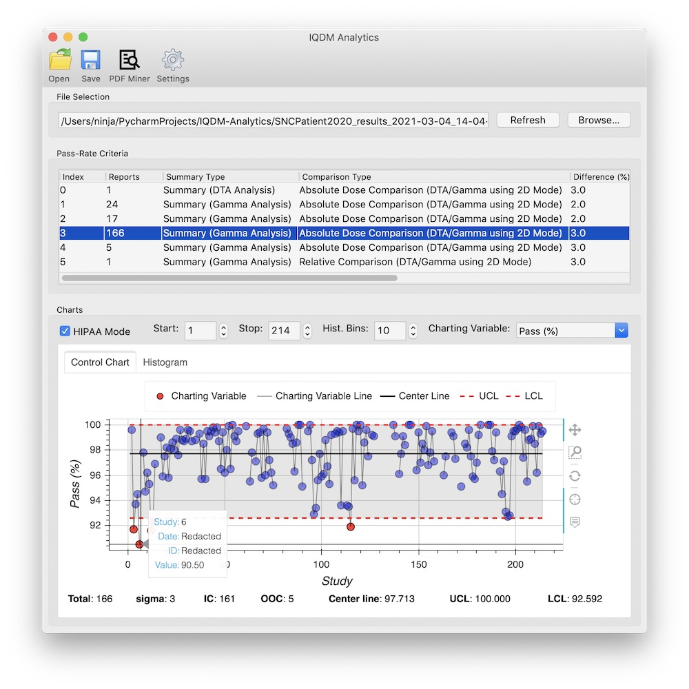

===========
User Manual
===========

This application is part of the IMRT QA Data Mining (IQDM) project for the AAPM
`IMRT Working Group (WGIMRT) <https://www.aapm.org/org/structure/?committee_code=WGIMRT>`__.

Introduction
------------
IQDM Analytics is a desktop application designed to make `IQDM-PDF <https://github.com/IQDM/IQDM-PDF>`__
more user friendly. IQDM-PDF is a python library used to mine data from IMRT
QA PDF reports for the purpose of generating control charts, as recommended
by `AAPM TG-218 <https://onlinelibrary.wiley.com/doi/10.1002/mp.12810/full>`__.

|screenshot|

Usage
-----
The easiest way to use this application is to download an executable from the
attachments in the `latest release <https://github.com/IQDM/IQDM-Analytics/releases/latest>`__
of IQDM Analytics.

Once you've launched the application, click on the PDF Miner icon in the
toolbar. From there you can select a directory to scan and another to store a
CSV file of mined data. Once this is complete (or if you already have an
IQDM-PDF CSV file), click on Open in the toolbar of main window to import
the CSV file.

The visuals are created with `Bokeh <https://github.com/bokeh/bokeh>`__ and
can be exported to HTML, SVG, or PNG files. Clicking the Save icon in the
toolbar will open a window allowing you to apply temporary visual
customizations prior to export. Alternatively, you can edit these visuals in
Settings to store the changes permanently.

Supported Vendors
-----------------
IQDM-PDF currently supports the following IMRT QA vendors / reports:

- Sun Nuclear: SNC Patient
- Scandidos: Delta4
- PTW: Verisoft

Methods
-------

----------
PDF Mining
----------
Generally speaking, the text from IMRT QA reports is extracted and
sorted into boxes with coordinates, using `pdfminer.six <https://pdfminersix.readthedocs.io/>`__.
Then IQDM-PDF searches for keywords to locate boxes containing data of
interest. For more details, see the `IQDM-PDF: How It Works <https://iqdm-pdf.readthedocs.io/en/latest/methods.html>`__
page.

Although IQDM-PDF has very thorough `testing <https://iqdm-pdf.readthedocs.io/en/latest/testing.html>`__,
it is prudent for users to manually inspect the CSV file generated. If you
find an error, please `submit an issue with IQDM-PDF <https://github.com/IQDM/IQDM-Analytics/issues>`__.
If you provide an anonymized report reproducing the error, it can be included
in the automated tests.

------------
Data Parsing
------------
Output from IQDM-PDF will be sorted in the following order:

1. Patient Name & ID ( & Plan ID/Name/SOPInstanceUID if available)
2. Analysis parameters (*e.g.*, dose, distance, threshold, etc.)
3. Measurement date & time (or report date)

If multiple reports are found with this sorting, IQDM Analytics can be
customized to select either the first or last report (by file creation timestamp),
or be set to the min, mean, or max value (calculated per charting variable).
See "Duplicate Value Policy" in Settings.

--------------
Control Charts
--------------
A control chart is simply a plot of chronological data with a center line and
control limits (upper and lower). The center line is the mean value of all
points. IQDM Analytics calculates a 2-point moving-range,

.. math::

   \overline { mR } = \frac { 1 }{ n-1 } \sum _{ i=2 }^{ n }{ \left| { x }_{ i }-{ x }_{ i-1 } \right|  }.

Control limits (:math:`CL`) are calculated with

.. math::

  CL=\overline { x } \pm 3\frac { \overline { mR }  }{ 1.128 },

where :math:`3` is the number of standard deviations, which can be
customized in Settings. Since the chart is based on a 2-point moving-range,
:math:`1.128` is used (*i.e.*, the value of :math:`d_2`). Note that control
limits are bounded if the population it describes also is bounded. For example,
the UCL of a gamma pass-rate will not exceed 100%.

The control chart in the main view uses the following acronyms:

- **IC**: In Control
- **OOC**: Out Of Control
- **UCL**: Upper Control Limit
- **LCL**: Lower Control Limit

Settings
--------
The Settings window allows you to customize plot visualizations such as colors,
widths/sizes, line styles, and transparency (alpha). Additionaly, there are
the following options:

- Control Limit standard deviations

  - Set the number of standard deviations for UCL/LCL calculations

- Duplicate Value Policy

  - If multiple reports are found for a given patient/date/ID, use either
    'first', 'last', 'min', 'mean', or 'max' value

- Multi-Threading Jobs

  - IQDM-PDF supports multi-threading, set the number of jobs used for PDF
    parsing

- Analyze .pdf only

  - IQDM-PDF looks only at .pdf files by default, allow it to try parsing any
    file

|settings|

Windows Users
-------------
The framework used to build this application (`wxPython <https://www.wxpython.org>`__)
leverages your operating system's web viewer to render web pages (such as the
Bokeh visuals in this application). Unfortunately, Windows still uses
Internet Explorer (IE) emulation. This means there is no drag functionality (so
no pan or zoom). These features can be recovered if you install
`Microsoft Edge Beta <https://www.microsoftedgeinsider.com/en-us/download>`__.
If this is installed, you should be able to check "Enable Edge WebView Backend"
in Settings. Note that it is much slower to initialize, but you can pan, zoom,
and show/hide plot components when clicking on legend items.

Alternatively, you can export your chart as html or navigate to
``~/Apps/iqdm_analytics/temp`` where the last chart you generated will live
as an html file until you render a new one in IQDM Analytics. Then open the
file in your browser of choice for full interactive functionality.

Local File Storage
------------------
IQDM Analytics will create the directory ``~/Apps/iqdm_analytics``. Your
options are stored here as a hidden file `.options`. This directory also
contains ``temp`` and ``logs`` directories. The ``temp`` directory is currently
only used for html file storage on Windows; ``logs`` contains a ``iqdma.log``
file if any python errors have been caught. This file will be helpful when
reporting any issues.

PyInstaller
-----------
The executables for IQDM Analytics are generated with `PyInstaller <https://www.pyinstaller.org>`__,
which basically packages a full version of python and necessary libraries.
When you run the executable, it unpacks into a temp directory with a location
depending on your OS, but starts with ``_MEIxxxxxx`` where ``xxxxxx`` is a
random number. If the application crashes or you kill the application, just
note that this folder `will not be automatically purged <https://github.com/pyinstaller/pyinstaller/issues/2379>`__.

.. |settings| image:: _static/iqdma_settings.png
   :alt: User Settings
   :width: 250