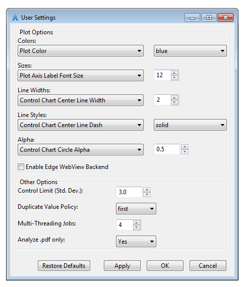

===========
User Manual
===========

**THIS PAGE IS STILL A WORK IN PROGRESS**

This application is part of the IMRT QA Data Mining (IQDM) project for the AAPM
`IMRT Working Group (WGIMRT) <https://www.aapm.org/org/structure/?committee_code=WGIMRT>`__.

Introduction
------------
IQDM Analytics is a desktop application designed to make `IQDM-PDF <https://github.com/IQDM/IQDM-PDF>`__
more user friendly. IQDM-PDF is a python library used to mine data from IMRT
QA PDF reports. Additionally, IQDM Analytics can sort results by pass-rate
criteria and generate control charts and histograms for any of the mined
variables.

|screenshot|

Supported Vendors
-----------------
IQDM-PDF currently supports the following IMRT QA vendors:

- Sun Nuclear: SNC Patient
- Scandidos: Delta4
- PTW: Verisoft

Methods - PDF Mining
--------------------
Generally speaking, the text from IMRT QA reports is extracted and
sorted into boxes with coordinates, using `pdfminer.six <https://pdfminersix.readthedocs.io/>`__.
Then IQDM-PDF searches for key words to locate boxes containing data of
interest. For more details, see the `IQDM-PDF: How It Works <https://iqdm-pdf.readthedocs.io/en/latest/methods.html>`__
page.

Although IQDM-PDF has very thorough `testing <https://iqdm-pdf.readthedocs.io/en/latest/testing.html>`__,
it is prudent for users to manually inspect the CSV file generated. If you
find an error, please `submit an issue with IQDM-PDF <https://github.com/IQDM/IQDM-Analytics/issues>`__.
If you provide an anonymized report reproducing the error, it can be included
in the automated tests.

Methods - Data Parsing
----------------------
Output from IQDM-PDF will be sorted in the following order:

1. Patient Name & ID ( plus Plan ID / Name / SOPInstanceUID)
2. Analysis parameters (e.g., dose, distance, threshold, etc.)
3. Measurement date & time (or report date)

If multiple reports are found with this sorting, IQDM Analytics can be
customized to select either the first or last report (by file creation time),
or be set to the min, mean, or max value (calculated per charting variable).

Methods - Control Charts
------------------------
A control chart is simply a plot of chronological data with a center line and
control limits (upper and lower). The center line is the mean value of all
points. IQDM Analytics calculates a 2-point moving-range,

.. math::

   \overline { mR } = \frac { 1 }{ n-1 } \sum _{ i=2 }^{ n }{ \left| { x }_{ i }-{ x }_{ i-1 } \right|  }.

Control limits (CL) are calculated with

.. math::

  CL=\overline { x } \pm 3\frac { \overline { mR }  }{ 1.128 }

where 3 is the number of standard deviations, which can be customized in Settings.
The ``1.128`` is the ``scalar_d`` value used when a 2-point moving-range is used.

The control chart in the main view uses the following acroymns:

- **IC**: In Control
- **OOC**: Out of Control
- **UCL**: Upper Control Limit
- **LCL**: Lower Control Limit

Note that control limits are bounded if the population it describes is also
bounded. For example, UCL of a gamma pass-rate will not exceed 100%.

Settings
--------
TODO

|settings|

.. |screenshot| raw:: html

    

